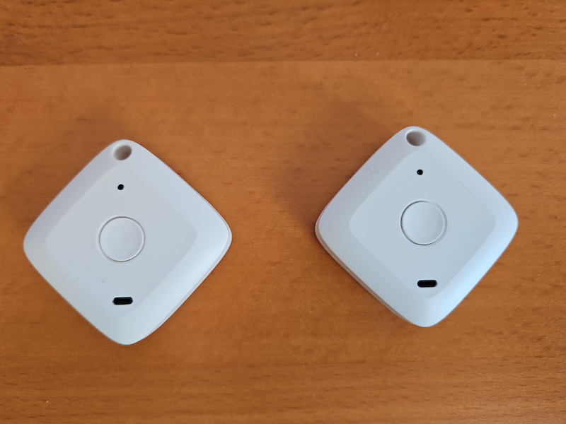

# Demo to read temperature and humidity from a Brifit Bluetooth sensor

## Overview
This little GO program will print the temperature and humidity of a Brifit Bluetooth sensor.
I bought a pair on Amazon for 20 Euros.

Output
````
2025/03/18 17:29:48 Inside sensor:  AA:BB:CC:DD:EE:F0 - 0.000000 - 0.000000
2025/03/18 17:29:48 Outside sensor: AA:BB:CC:DD:EE:F1 - 0.000000 - 0.000000
2025/03/18 17:29:48   Inside Temp: 24.1°C - Hum: 29.6% - Bat: 3030 - RSSI: -61 - Uptime: 2d, 6h, 15m
2025/03/18 17:29:53  Outside Temp: 23.6°C - Hum: 28.2% - Bat: 3060 - RSSI: -53 - Uptime: 2d, 0h, 43m
````

The battery level is the 16-bit value without a conversion. I think it could be mV (milli Volt). RSSI is showing the 
signal strength and the uptime shows the converted seconds. See comments in source code for details.

The sensors I bought have the model no. WS02, but other types will probably work the same.



## Acknowledgements
The formula to convert the 16-bit value of temperature and humidity is from the github
repository [of user iskalchev](https://github.com/iskalchev/ThermoBeacon).
